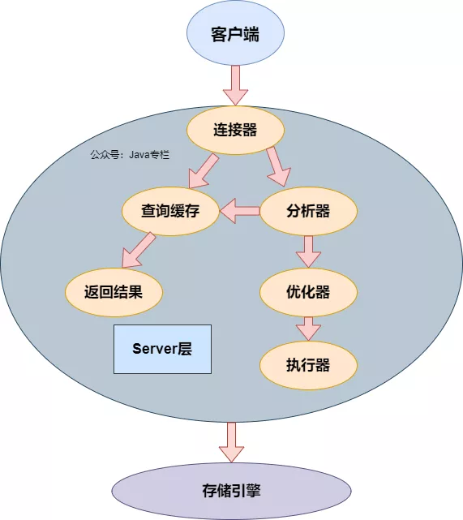

select name from user where id = 1;

上面是一个简单的查询语句，交给数据库去执行，然后返回name。看起来很简单，可是内部的执行过程却很多人都不知道。

今天就把MySQL拆开看看，看一下它究竟是怎么工作的。

## SQL基本架构

可以看出,MySQL分为Server层和存储引擎层。

## Server层
连接器
连接器主要是与客户端建立连接， 包含本地socket和大多数基于客户端/服务端工具实现的类似于tcp/ip的通信。连接成功之后会同时校验用户的权限，等相关安全方案。如我们常用的建立连接方式

mysql -h ip -P 3306 -u root -p

连接是可以在-p后面输入密码，但是考虑到安全问题 不建议这样操作，-P 后是端口号，-p 是密码。注意大小写。

登录成功之后，会校验当然登录账号的权限。后续所有的数据库操作都被当前权限所限制。因此，管理员修改用户权限时，不会立即生效，需要重新连接才会生效。

MySQL默认情况下，当一个链接空闲超过8（60 60 8）小时之后会自动断开连接。但是连接池则以为该被断开的连接依然有效。这个时候如果客户端代码发送请求时，连接池会把已经失效的代码返回至客户端。这样就会导致代码异常。

通过`show global variables like '%timeout%'`可进行查看， 缺省情况下是使用 wait_timeout 这个字段。


另外可以用 `show processlist; `用来显示用户正在运行的线程。

注意：除了 root 用户能看到所有正在运行的线程外，其他用户都只能看到自己正在运行的线程，看不到其它用户正在运行的线程。除非单独个这个用户赋予了PROCESS 权限。


## 查询缓存
当我们建立连接之后，执行SQL语句时，会先进行缓存查询（如果开启了缓存查询）。如果之前执行了相同的SQL语句，则会从缓存中直接返回结果。这个过程可以理解为SQL文本和查询结果的映射。

但是查询缓存真的能提升效率吗？理论上，不建议开启查询缓存

因为缓存和失效都会有额外的资源消耗，数据发生改变或者表结构发生改变时，都会导致缓存失效。最差的情况就是你刚建立了一份缓存，另外一边又有人修改数据。这样导致缓存失效，重新建立了一份新的缓存。

有这些INSERT、UPDATE、 DELETE、TRUNCATE、ALTER TABLE、DROP TABLE或DROP DATABASE会导致缓存数据失效。所以查询缓存适合有大量相同查询的应用，不适合有大量数据更新的应用

在MySQL8.0的版本删除了查询缓存的功能。

如果你是8.0之前的版本，可以通过以下方法关闭查询缓存：

1、临时关闭，直接执行命令行
```
set global query_cache_size=0


set global query_cache_type=0
```
2、永久关闭，修改配置文件my.cnf ,添加下面的配置即可。
```
query_cache_type=0


query_cache_size=0
```

## 分析器
当在查询缓存中没有找到对象的查询结果时，这时候就需要分析器对SQL进行解析。比如解析出响应的关键词。如Select（查询）、Delete（删除）等等，同时也会把相应的表明、字段名都分析出来。如果SQL语法错误，会告诉我们You have an error in your SQL syntax

## 优化器
SQL实际的执行顺序不一定就是我们写的顺序。在通过分析器的解析，数据库知道了我们要做什么。然后会按照一定的规则重写SQL。当有多个索引的时候，优化器也会决定去使用哪个索引；当多表关联查询的时候，也会去决定各个表的链接顺序。总之，优化器会通过一系列的算法规则去给出一个最优的执行策略。

## 执行器
SQL通过分析器知道要做什么，通过优化器知道该怎么做。最后通过执行器就进入了执行阶段。

首先会根据连接的账号查看是否有操作该表的权限。如果没有，则返回权限错误。如果有权限，则继续执行。

打开表的时候，执行器会根据表的引擎 去使用该引擎提供的接口。

## 存储引擎层
存储引擎层负责数据的存储和提取。

可通过show engines查看MySQL的存储引擎。存储引擎有InnoDB、MylSAM、MEMORY、MERGE等等...

但是我们常用的基本是InnoDB和MylSAM。

InnoDB在5.5.5版本之后为默认的存储引擎

## InnoDB
InnoDB是一个事务型的存储引擎，有行级锁定和外键约束,提供了具有提交，回滚和崩溃恢复的事务安全，但是对比MyLSAM引擎，写的效率会比差一些，并且会占用更多的磁盘空间以保持数据和索引。

特点:

更新多的表，适合处理多重并发的更新请求。

支持事务。

可以从灾难中恢复（通过bin-log日志等）。

外键约束。只有他支持外键。

支持自动增加列属性auto_increment。

## MylSAM
Mylsam 存储引擎独立于操作系统，简单说就是可用在windows上使用，也可用将数据转移到Lunex操作系统上。系统兼容性很好！！！。这种存储引擎在建表的时候，它会创建3个文件。分别是（.frm, .MYD, .MYI），简单说明一下：.frm 存储表的定义（也就是表结构啦），.MYD 就是表里面的数据，.MYD存储索引。这样的划分操作系统对大文件的操作是比较慢的，这样将表分为三个文件，那么.MYD这个文件单独来存放数据自然可以优化数据库的查询等操作。

特点:

1、不支持事务

2、不支持外键

3、查询速度很快。如果数据库insert和update的操作比较多的话采用表锁效率低（建议使用innodb）。

4、对表进行加锁


