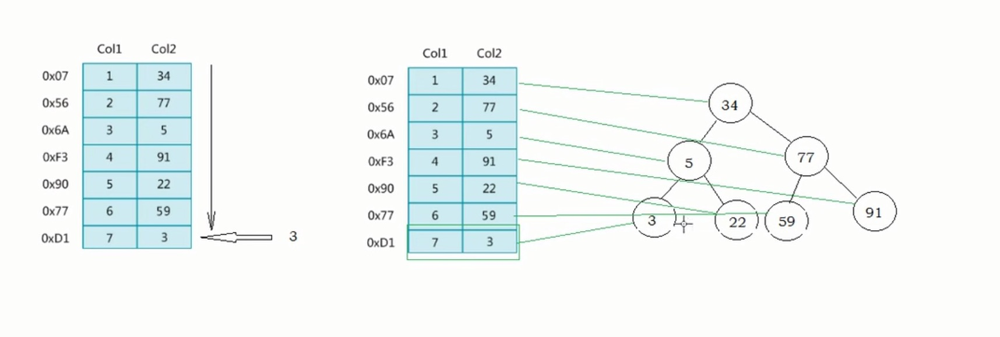
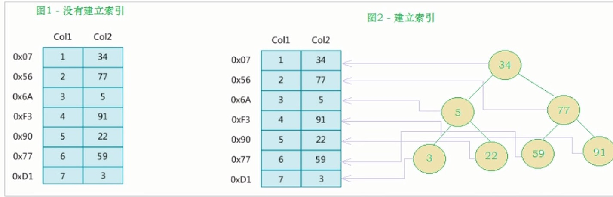
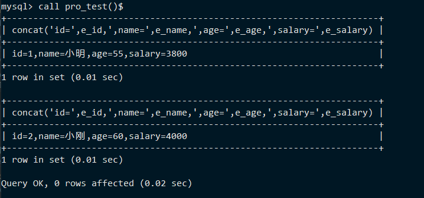
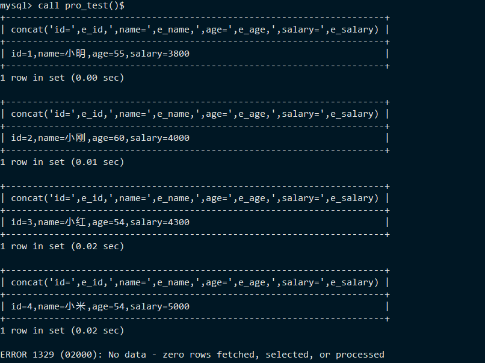
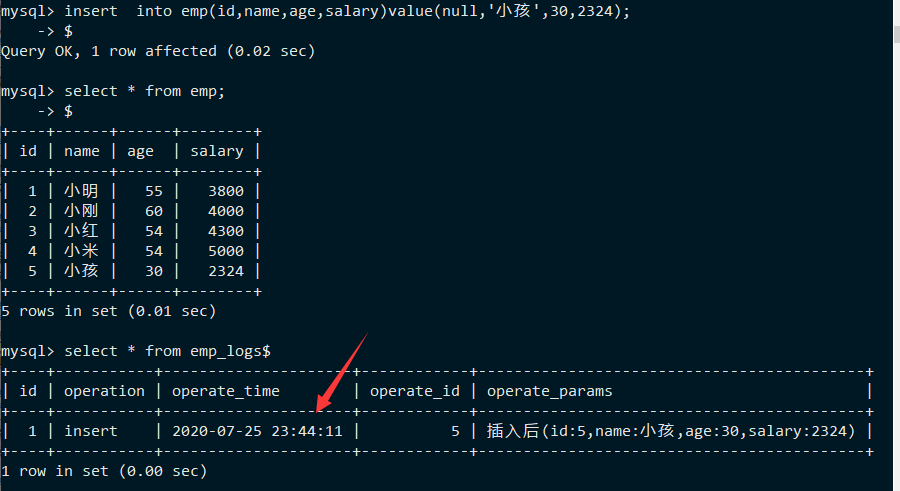

## 第一天

### 安装MySQL
rpm -qa | grep -i mysql // 查看当前系统是否预装mysql
rpm -e xxx(上一步命令全部内容) --nodeps // 卸载


### Linux启动mysql
service mysql status // 查看状态
service mysql start // 启动
service mysql stop // 关闭

linux安装mysql会随机生成一个密码，可以在 /root/.mysql_secret文件里查看
或者使用命令 grep "password" /var/log/mysqld.log 查看

进入mysql控制台之后，开始设置新密码。

set password = password('密码');
然后重新登陆


## 索引
### 索引概述
索引定义：索引（index）是帮助mysql高效获取数据的数据结构（有序）。在数据之外，数据库系统维护者满足特定查找算法的数据结构，这些数据结构以某种方式引用（指向）数据，这样就可以在这些数据结构上实现高级查找算法，这种数据结果就是索引，
如下图所示：



左边是数据表。一共有两列7条记录，最左边的是数据记录的物理地址（注意逻辑上相邻的记录在磁盘上也并不是一定往里相邻的）。为了加快Col2
的查找，可以维护一个右边所示的二叉查找树，每个节点分别包含索引键值和一个指向对应数据记录物理地址的指针，这样就可以运用二叉查找快速获取到相应数据。

一般来说，索引本身也很大，不可能全部存在内存中，因此索引往往会以索引文件的形式存在磁盘上，索引是数据库中用来提高性能的最常用的工具。


没有建立索引就需要全表扫描，进行遍历.
如果是上亿条记录，那么查询会非常缓慢。


### 索引优势劣势

优势：
1. 类似于书籍的目录索引，提高数据检索的效率，降低数据库的IO成本。
2. 通过索引列对数据进行排序，降低数据排序的成本，降低CPU的消耗。


劣势：
1. 实际上索引也是一张表，该表中保存了主键与索引字段，并指向实体类的记录，所以索引列也是要占用空间的
2. 虽然索引大大提高了查询效率，同时却也降低更新表的速度，如对表进行INSERT,UPDATE,DELETE。因为更新表时，MySQL不仅要保存数据，还要保存一下索引文件每次更新添加了索引列的字段，都会调整因为更新所带来的键值变化后的索引信息。
（这其实也就是提高了查操作的效率，而牺牲了增删改的效率）


### 索引结构

索引是在MySQL的存储引擎中实现的，而不是在服务器层实现的。所以每种存储引擎的索引都不一定完全相同，也不是所有的存储引擎都支持所有的索引类型的。
MySQL目前提供了以下4种索引：
- BTREE索引：最常见的索引类型，大部分索引都支持B树索引
- HASH索引：只有Memory引擎支持，使用场景简单
- R-tree索引（空间索引）：空间索引是MyISAM引擎的一个特殊索引类型，主要用于地理空间数据类型，通常使用较少，不做特别介绍
- Full-text（全文索引）：全文索引也是MyISAM的一共个特殊索引类型，主要用于全文索引，InnoDB从MySQL5.6版本开始支持全文索引。


MyISAM，InnoDB，Memory三种存储引擎对各种索引类型的支持
|索引|InnoDB引擎|MyISAM引擎|Memory引擎|
|:---:|:---:|:---:|:---:|
|BTREE索引|支持|支持|支持|
|HASH索引|不支持|不支持|支持|
|R-tree索引|不支持|支持|不支持|
|Full-text|5.6版本后支持|支持|不支持|


### BTREE结构

BTree又叫多路平衡搜索树，一颗m叉的Btree特性如下：
- 树中每个节点最多包含m个孩子
- 除根节点与叶子节点外，每个节点至少有[ceil(m/2)]个孩子
- 若根节点不是叶子节点，则至少有两个孩子
- 所有的叶子节点都在同一层
- 每个非叶子节点由n个key与n+1个指针组成，其中[ceil(m/2)-1]<=n<=m-1


### B+Tree结构
B+Tree为BTree的变种，B+Tree与BTree的区别为：
- 


### 索引分类
1. 单值索引：即一个索引只包含单个列，一个表可以有多个单列索引。
2. 唯一索引：索引列的值必须唯一，但允许有空值
3. 复合索引：即一个索引包含多个列


### 索引语法
MySQL数据库中会为主键自动默认创建一个索引，所以勿须对主键创建索引。
语法：
``` sql
CREATE [UNIQUE | FULL TEXT | SPATIAL] INDEX index_name
[USING index_type]
ON tbl_name(index_col_name,....)
index_col_name:column_name[(length)][ASC | DESC]
```
[]可选项

查看索引：
``` sql
show index from table_name;
OR
show index from table_name\G;
```

删除索引：
``` sql
drop index  index_name on table_name;
```


修改表创建索引：
```  sql
alter table table_name add primary key(column_list); # 该语句添加一个主键，这意味着索引值必须是唯一的，且不能为NULL

alter table table_name add unique index_name(column_list); # 这条语句创建索引的值必须是唯一的（除了null外，null可能会出现多次）

alter table table_name add index index_name(column_list); # 添加普通索引，索引值可以出现多次

alter table table_name add fulltext index_name(column_list); # 该语句指定了索引为FULLTEXT，用于全文索引

```


### 索引设计原则
索引的设计可以遵循一些已有的原则，创建索引的时候请尽量考虑符合这些原则，便于提升索引的使用效率，更高效的使用索引。
- 对查询频次较高，且数据量比较大的表建立索引
- 索引字段的选择，最佳候选列应当从where子句的条件中提取，如果where子句中的组合比较多，那么应当挑选最常用，过滤效果最好的列的组合
- 使用唯一索引，区分度越高，使用索引的效率越高
- 索引可以有效地提升查询数据的效率，但索引数量不是多多益善，索引越多，维护索引的代价自然也就水涨船高。对于插入，更新，删除等DML操作比较频繁的表来说，索引过多，会引入相当高的维护代价，降低DML操作的效率，增加相应操作的时间消耗。另外索引过多的话，MySQL也会犯选择困难症，虽然最终仍然会找到一个可用的索引，但无疑提高了选择的代价
- 使用短索引，索引创建之后也是使用硬盘来存储的，因此提升索引访问的I/O效率，也可以提升总体的访问效率。假如构成索引的字段总长度比较短，那么在给定大小的存储块内可以存储更多的索引值，相应的可以有效地提升MySQL访问索引的I/O效率
- 利用最左前缀，N个列组合而成的组合索引，那么相当于是创建了N个索引，如果查询时where子句中使用了组成该索引的前几个字段，那么这条查询sql可以利用组合索引来提升查询效率。


## 视图

视图（view）是一种虚拟存在的表。视图并不在数据库中实际存在，行和列数据来自自定义视图的查询中使用的表，并且是在使用动图时动态生成的。通俗的讲，视图就是一条select语句执行后返回的结果集。所以我们在创建视图的时候，主要的工作就落在创建这条sql查询语句上。
视图相对于普通的表的优势主要包括以下几项：
- 简单：使用视图的用户完全不需要关心后面对应的表的结构，关联条件和筛选条件，对用户来说已经是过滤好的符合条件的结果集。
- 安全：使用视图的用户只能访问它们被允许查询的结果集，对表的权限管理并不能限制到某个行某个列，但是通过视图就可以简单的实现（因为视图可以筛选出特定的字段，相当于重新创建了一个新表）
- 数据独立：一旦视图的结构确定了，可以屏蔽表结构变化对用户的影响，源表增加列对视图没有影响；源表修改列名，则可以通过修改视图来解决，不会造成对访问者的影响


### 创建视图或者修改视图
创建视图语法：
``` sql
CREATE [OR REPLACE] [ALGORITHM = {UNDEFAINED | MERGE | TEMPTABLE}]
VIEW view_name [(column_list)]
AS select_statement
[WITH [CASCADED | LOCAL] CHECK OPTION]
```


视图本身也是一种表，所以怎么查询表就怎么查询视图
select * from view_name ;

使用update更新字段数据之后，其实更新的是基表的数据，而并不是视图的数据。因为视图就是虚拟存在的表。


修改视图语法：
``` sql
ALTER [ALGORITHM = {UNDEFAINED | MERGE | TEMPTABLE}]
VIEW view_name [(column_list)]
AS select_statement
[WITH [CASCADED | LOCAL] CHECK OPTION]
```


选项：WITH [CASCADED | LOCAL] CHECK OPTION 决定了是否允许更新数据使记录不再满足视图的条件
LOCAL:只要满足本视图的条件就可以更新
CASCADED:必须满足所有针对该视图的所有视图的条件才可以更新


查看视图语法：
``` sql
show tables;

```
从5.1版本开始，使用show tables命令的时候不仅显式表的名字，同时也会显式视图的名字，而不存在单独显式视图的show views命令。

查看创建视图时使用的select语句：
show create view view_table;


在使用 show table status命令的时候，不但可以显式表的信息，同时也可以显式视图的信息。


删除视图语法：
``` sql
DROP VIEW [IF EXISTS] view_name [,view_name] ...[RESTRICT | CASCADE]
```

## 存储过程
### 概述
存储过程和函数是事现经过编译并存储在数据库中的一段sql语句的集合，调用存储过程和函数可以简化应用开发人员的很多工作，减少数据在数据库和应用服务器之间的传输，对于提高数据处理的效率是有好处的。

存储过程和函数的区别在于函数必须有返回值，而存储过程没有。

函数：是一个有返回值的过程
过程：是一个没有返回值的函数


### 创建存储过程
``` sql

CREATE PROCEDURE procedure_name ([proc_parameter[,....]])
begin 
 -- sql语句
end;
```


DELIMITER
该关键字用来声明sql语句的分隔符，告诉MySQL解释器，该段命令是否已经结束了，MySQL是否可以执行了。默认情况下，delimiter是分号；在命令行客户端中，如果有一行命令以分号结束，那么回车后，MySQL将会执行该命令。
``` sql
delimiter $ -- 将分隔符替换为$，也就是此时当结尾使用$才为一行命令的结束
``` 


创建存储过程 示例
``` sql
delimiter $

create procedure pro_test()
begin 
    select 'hello mysql'; -- 为了使得这里的;不会结束，只能替换分隔符
end$

delimiter ;
```

### 调用存储过程
``` sql
call procedure_name();
```

查看存储过程
三种方式：

``` sql
-- 查询db_name数据库中的所有存储过程
select name from mysql.proc where db='db_name';

-- 查询存储过程的状态信息
show procedure status;


-- 查询某个存储过程的定义
show create procedure procedure_name \G;
```
示例：show create procedure  pro_test \G;


删除存储过程
``` sql
DROP PROCEDURE [IF EXISTS] procedure_name;
```


## 语法
存储过程就是封装好的sql语句，从而达到复用的目的，这个类似于编程语言中的函数功能。都是对某一功能操作实现的封装。

存储过程是可编程的，意味着可以使用变量，表达式，控制结构，来完成比较复杂的功能。

### 变量
- DECLARE 
通过DECLRAE可以定义一个局部变量，该变量的作用范围只能在BEGIN...END块中。
``` sql
DECLARE var_name[,....] type [DEFAULT value]
```


示例：
``` sql
delimiter $

create procedure procedure_name()
begin 
    declare num int default 5;
    select num + 10;
end$

delimiter ;
```

### 赋值操作
直接赋值使用set，可以赋常量或者赋表达式，具体语法如下：
``` sql
SET var_name = expr [,var_name = expr]...
```
示例：
``` sql
delimiter $

create procedure pro_test()
begin 
    declare name varchar(20);
    set name = 'mysql';
    select name;
end$

edlimiter ;

call pro_test(); -- 调用存储过程
```

也可以通过select...into方式进行赋值操作：
示例：
``` sql
DELIMITER $

create procedure pro_test()
begin 
    declare countnum int;
    select count(*) into countnum from city; -- into表示将查询返回的结构赋值给countnum
    select concat('city表中的记录数为：',countnum);
end$

DELIMITER ;

call pro_test(); -- 调用存储过程
```
其中，set用于赋值常量，select into用于赋值表达式。

### if条件判断

语法结构：
``` sql
if search_condition then statement_list
    [elseif search_conition then statement_list]....
    [else statement_list]
end if;
```

需求：
根据定义的身高变量，判断当前身高的所属的身材类型

``` sql
180 及以上 ------> 身材高挑
170-180 ------> 标准身材
170 以下 ------> 一般身材
```
示例：
``` sql
DELIMITER $
create procedure pro_test()
begin 
    declare height int default 175;
    declare description varchar(50) default '';
    if height >= 180 then
        set description = '身材高挑';
    elseif height >= 170 and height < 180 then
        set description = '标准身材';
    else 
        set description = '一般身材';
    end if;
    select concat('身高',height,'对应的身材类型为',description);
end $

DELIMITER ;
call pro_test();

-- 输出
身高 175 对应的身材类型为 标准身材
```

### 输入参数

传递参数：
语法格式：
``` sql
create procedure procedure_name([in/out/inout] 参数名 参数类型)
....

IN: 该账户可以作为输入，也就是需要调用方传入值，默认
OUT: 该参数作为输出，也就是该参数可以作为返回值
INOUT: 既可以作为输入参数，也可以作为输出参数
```

IN-输入
需求：
根据定义的身高变量，判定当前身高的所属的身材类型
示例：
``` sql
DELIMITER $
create procedure pro_test(in height int)
begin 
    declare description varchar(50) default '';
    if height >= 180 then
        set description = '身材高挑';
    elseif height >= 170 and height < 180 then
        set description = '标准身材';
    else 
        set description = '一般身材';
    end if;
    select concat('身高',height,'对应的身材类型为',description);
end $

DELIMITER ;
call pro_test(198); -- 在存储过程中传入实际参数

-- 输出
-- 身高 198 对应的身材类型为 身材高挑
```


OUT-输出
需求：
根据传入的身高变量，获取当前身高的所属的身材类型（返回值）
``` sql
DELIMITER $
create procedure pro_test(in height int,out description varchar(10))
begin 
    if height >= 180 then
        set description = '身材高挑';
    elseif height >= 170 and height < 180 then
        set description = '标准身材';
    else 
        set description = '一般身材';
    end if;
end $

DELIMITER ;
call pro_test(188,@description); -- 在存储过程中传入实际参数,并且@description表示用户的会话变量，该变量用于接收返回值，因为我们不能传入返回值，只能使用一个变量去接收返回值
select @description;
-- 输出
-- 身高 188 对应的身材类型为 身材高挑
```
Tip：@description：这种变量要在变量名称前面加上"@"符号，叫做用户会话变量，代表**整个会话过程它都是有作用**的，这个类似于全局变量一样。
@@global.sort_buffer_size:这种在变量前加上"@@"符号，叫做系统变量。

``` sql
set @name='hello';
select @name;
-- 输出：hello
```


### case结构

语法结构：
方法一：
``` sql
CASE case_value
 WHERE when_value THEN statement_list
 [WHEN when_value THEN statement_list] ...
 [ELSE statement_list]
END CASE;
```

方式二：
``` sql
CASE 
    WHEN search_condition THEN statement_list
    [WHEN search_condition THEN statemnt_list]...
    [ELSE statement_list]
END CASE;
```
示例：
需求：给定一个月份，然后计算出所在的季度
``` sql
DELIMITER $

create procedure pro_test(mon int)
begin
    declare result varchar(10);
    case 
        when mon >= 1 and mon <= 3 then
            set result = '第一季度';
        when mon >= 4 and mon <= 6 then
            set result = '第二季度';
        when mon >= 7 and mon <= 9 then
            set result = '第三季度';
        else
            set result = '第四季度';
    end case;
select concat('传递的月份为:',mon,'计算出的结果为',result) as content;
end$

DELIMITER ;

call pro_test(9);
-- 输出
-- 传递的月份为 9 ，计算出的结果为第三季度
```

### 循环
while循环
语法结构：
``` sql
while search_condition do
    statement_list
end while;
```

需求：计算从1加到n的值
示例：
``` sql
DELIMITER $
create procedure pro_test(n int)
begin 
    declare total int default 0;
    declare start int default 0;

    while start <= n do
        set total = total + start;
        set start = start + 1;
    end while;
select total;
end$
DELIMITER ;
call pro_test(9);
```


### repeat循环
有条件的循环控制语句，当满足条件的时候退出循环。while是满足条件才执行，repaet是满足条件就退出循环。
语法结构：
``` sql
REPAET 
    statement_list
    UNTIL search_condition -- 这里注意没有分号
END REPAET;
```

示例
需求：计算从1到n的值
``` sql
DELIMITER $
create procedure pro_test(n int)
begin 
    declare total int default 0;
    repeat 
        set toal = total + n;
        set n = n - 1;
        until n = 0
    end repeat;
select total;
end@
DELIMITER ;
call pro_test(100);
```
### loop循环
LOOP实现简单的循环，退出循环的条件需要使用其他的语句定义，通常可以使用leave语句实现，具体语法如下：
``` sql
[begin_label:] LOOP
    statement_list
END LOOP[end_lable]
```
如果不在statement_list中增加退出循环的语句，那么LOOP语句可以用来实现简单的死循环。
begin_label是循环的别名。


### leave语句
用来从标注的流程语句构造中退出，通常和BEGIN...END或者循环一起使用。下面是一个使用LOOP和LEAVE的简单例子，退出循环：
``` sql

delimiter $
create procedure pro_test(n int)
begin
    declare total int default 0;
    ins:loop
        if n <= 0 then
            leave ins;
        end if;

```

需求：计算从1到n的值
示例：
``` sql
delimiter $
create procedure pro_test(n int)
begin 
    declare total int default 0;
    c:loop
        set total = total + n;
        set n = n - 1;
        if n <= 0 then
            leave c;
        end if;
    end loop c;
    select total;
end $
delimiter ;
call pro_test(99);
```


### 游标/光标
游标是用来存储查询结果集的数据类型（游标是存储查询结果集的容器），在存储过程和函数可以使用光标对结果集进行循环的处理。光标的使用包括光标的声明，（打开）OPEN，（相当于记录指针，用于遍历）FETCH,（关闭，退出游标)CLOSE，其语法分别如下：
声明光标：`DECLARE cursor_name CURSOR FOR select_statement;`
OPEN光标： `OPEN cursor_name;`
FETCH光标：`FETCH cursor_name INTO var_name [,var_name]...`
CLOSE光标：`CLOSE cursor_name;`

示例：
初始化脚本：
``` sql
create table emp(
    id int(11) not null auto_increment,
    name varchar(50) not null comment '姓名',
    age int(11) comment '年龄',
    salary int(11) comment '薪水',
    primary key(`id`)
) engine=innodb default charset=utf8;

insert into emp(id,name,age,salary) value (null,'小明',55,3800),(null,'小刚',60,4000),(null,'小红',54,4300),(null,'小米',54,5000);
```

示例：
需求：查询emp表中数据，并逐行进行展示
``` sql
delimiter $
create procedure pro_test()
begin
    declare e_id int (11);
    declare e_name varchar(50);
    declare e_age int(11);
    declare e_salary int(1);
    declare emp_result cursor for select * from emp;
    open emp_result;

    fetch emp_result into e_id,e_name,e_age,e_salary;
    select concat('id=',e_id,',name=',e_name,',age=',e_age,',salary=',e_salary);

    fetch emp_result into e_id,e_name,e_age,e_salary;
    select concat('id=',e_id,',name=',e_name,',age=',e_age,',salary=',e_salary);

    close emp_result;
end $
delimiter ;
call pro_test();
```
输出结果：



因为第一个fetch读取第一行，第二个fetch读取第二行。
``` sql
delimiter $
create procedure pro_test()
begin
    declare e_id int (11);
    declare e_name varchar(50);
    declare e_age int(11);
    declare e_salary int(1);
    declare emp_result cursor for select * from emp;
    open emp_result;

    fetch emp_result into e_id,e_name,e_age,e_salary;
    select concat('id=',e_id,',name=',e_name,',age=',e_age,',salary=',e_salary);

    fetch emp_result into e_id,e_name,e_age,e_salary;
    select concat('id=',e_id,',name=',e_name,',age=',e_age,',salary=',e_salary);

    fetch emp_result into e_id,e_name,e_age,e_salary;
    select concat('id=',e_id,',name=',e_name,',age=',e_age,',salary=',e_salary);

    fetch emp_result into e_id,e_name,e_age,e_salary;
    select concat('id=',e_id,',name=',e_name,',age=',e_age,',salary=',e_salary);

    fetch emp_result into e_id,e_name,e_age,e_salary;
    select concat('id=',e_id,',name=',e_name,',age=',e_age,',salary=',e_salary);

    close emp_result;
end $
delimiter ;
call pro_test();
```
数据表中只有4条记录，但是我们使用5个fetch，那么会出现什么结果：


### 循环获取游标

``` sql
delimiter $
create procedure pro_test()
begin
    declare e_id int (11);
    declare e_name varchar(50);
    declare e_age int(11);
    declare e_salary int(1);
    declare has_data int default 1;
    declare emp_result cursor for select * from emp;
    DECLARE EXIT HANDLER FOR NOT FOUND set has_data = 0; -- 这句话必须在游标之后，这是一个MySQL句柄
   
    open emp_result;
    repeat 
        fetch emp_result into e_id,e_name,e_age,e_salary;
        select concat('id=',e_id,',name=',e_name,',age=',e_age,',salary=',e_salary);
        until has_data = 0
    end repeat;

    close emp_result;
end$ 
delimiter ;
call pro_test();
```

### 存储函数(了解)
语法结构：
``` sql
CREATE FUNCTION function_name([param type...])
RETURNS type -- 类似于定义返回值类型
BEGIN
    ...
END;
```
示例：
定义一个存储过程，请求满足条件的总记录数：
``` sql
delimiter $

create function count_city(countryId int)
returns int
begin 
    declare cnum int;
    select count(*) into cnum from city where coutry_id = countryId;
    return cnum;
end$

delimiter ;
select count_city(1); -- 调用函数
```

drop function count_city; -- 删除存储函数


## 触发器
### 介绍
触发器是与表有关的数据库对象，指在insert/update/delete之前或之后，触发并执行触发器中定义的SQL语句集合。触发器的这种特性可以协助应用在数据库端确保数据的完整性，日志记录，数据校验等操作。

使用别名 OLD 和 NEW 来引用触发器中发生变化的记录内容，这与其他的数据库是相似的。现在触发器还只支持行级触发，不支持语句级触发。

| 触发器类型 | NEW和OLD的使用 |
| :----:| :----:  |
|INSERT型触发器|NEW表示将要或者已经新增的数据|
|UPDATE型触发器|OLD表示修改之前的数据，NEW表示将要或已经修改后的数据|
|DELETE型触发器|OLD表示将要或者已经删除的数据|


### 创建触发器

语法结构：
``` sql
create trigger trigger_name

before/after insert/update/delete

on tbl_name

[for each row] -- 行级触发器

begin
    trigger_stmt;
end;
```
示例：
需求：通过触发器记录 emp 表的数据变更日志，包含增加，修改，删除；
首先创建一张日志表：
``` sql
create table emp_logs(
    id int(11) not null auto_increment,
    operation varchar(20) not null comment '操作类型,insert/update/delete',
    operate_time datetime not null comment '操作时间',
    operate_id int(11) not null comment '操作表的ID',
    operate_params varchar(500) comment '操作参数',
    primary key(`id`)
)engine=innodb default charset=utf8;
```

通过insert型触发器，完成插入数据时的日志记录：

``` sql
delimiter $
create trigger emp_logs_insert_trigger
after insert
on emp
for each row 
begin 
    insert into emp_logs(id,operation,operate_time,operate_id,operate_params)
    values(null,'insert',now(),new.id,concat('插入后(id:',new.id,',name:',new.name,',age:',new.age,',salary:',new.salary,')'));
end $

delimiter ;

insert into emp(id,name,age,salary)values(null,'小孩',30,4380); -- 测试
select * from emp_logs; -- 查询
```



update型触发器
``` sql
delimiter $
create trigger emp_logs_update_trigger
after update
on emp
for each row 
begin 
    insert into emp_logs(id,operation,operate_time,operate_id,operate_params)
    values(null,'update',now(),new.id,concat('修改前(id:',old.id,',name:',old.name,',age:',old.age,',salary:',old.salary,'),修改后(id:',new.id,',name:',new.name,',age:',new.age,',salary:',new.salary));
end $

delimiter ;

update emp set age=39 where id=3; -- 测试
select * from emp_logs; -- 查询
```


delete型触发器
``` sql
delimiter $

create trigger emp_logs_delete_trigger
after delete
on emp
for each row 
begin 
    insert into emp_logs(id,operation,operate_time,operate_id,operate_params)
    values(null,'delete',now(),old.id,concat('删除前(id:',old.id,',name:',old.name,',age:',old.age,',salary:',old.salary,')'));
end $

delimiter ;

delete from emp where id=3; -- 测试
select * from emp_logs; -- 查询

```

### 删除触发器
语法结构:
``` sql
drop trigger [schema_name.]trigger_name;
```
如果没有指定scheam_name,默认为当前数据库


### 查看触发器
可以通过执行 SHOW TRIGGERS命令查看触发器的状态,语法等信息.
语法结构:
``` sql
show triggers;
```