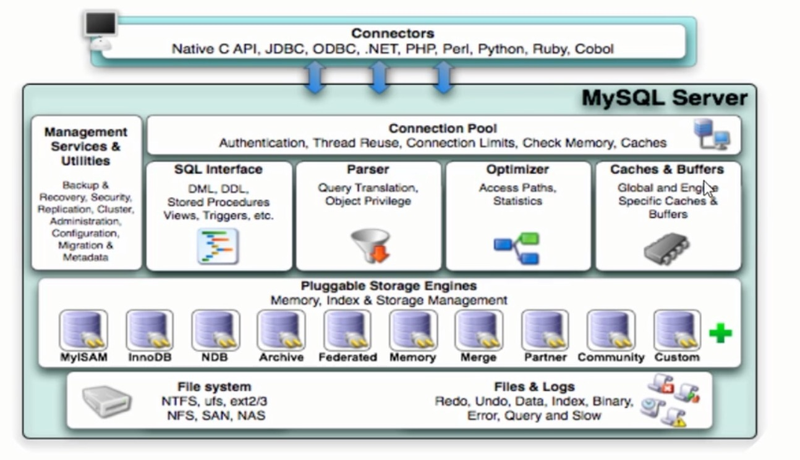
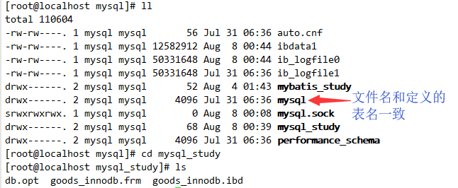

# Day2

## MySQL架构
mysql的体系结构概述



整个MySQLserver由以下组成
- connection Pool:连接池组件
- Management Services & Utilities:管理服务和工具组件
- SQL Interface:SQL接口组件
- Parser：查询分析器组件
- Optimizer:优化器组件
- Caches & Buffers：缓冲池组件
- Pluggable Storage Engines:存储引擎
- File System:文件系统

1. 连接层
最上层是一些客户端和链接服务，包含本地socket通信和大多数基于客户端/服务端工具实现的类似于TCP/IP的通信。主要完成一些类似于连接处理，授权认证，及相关的安全方案。在该层上引入了线程池的概念，为通过认证安全接入的客户端提供线程。同样在该层上可以实现基于SSL的安全链接。服务器也会为安全接入的每个客户端验证它所具有的操作权限。
2. 服务层
第二层架构主要完成大多数的核心服务功能，如sql接口，并完成缓存的查询，sql的分析和优化，部分内置函数的执行。所有跨存储引擎的功能也在这一层实现，如过程，函数等。在该层，服务器会解析查询并创建相应的内部解析树，并对其完成相应的优化如确定表的查询的顺序，是否利用索引等，最后生成相应的执行操作。如果是select语句，服务器还会查询内部的缓存，如果缓存空间足够大，这样在解决大量读操作的环境中能够很好的提升系统的性能。
3. 引擎层
存储引擎层，存储引擎真正的负责了MySQL中数据的存储和提取，服务器会通过API和存储引擎进行通信，不同的存储引擎具有不同的功能，这样我们可以根据自己的需求，来选取合适的存储引擎。
4. 存储层
数据存储层，主要是将数据存储在文件系统之上，并完成与存储引擎的交互。

和其他数据库相比，MySQL有点与众不同，它的架构可以在多种场景中应用并发挥良好作用。主要体现在存储引擎上，插件式的存储引擎架构，将查询处理和其他的系统任务以及数据的存储提取分离。这种架构可以根据业务的需求和实际需要选择合适的存储引擎。


## 存储引擎
2.1 存储引擎概述
和大多数的数据库不同，MySQL中有一个存储引擎的概念，针对不同的存储需求可以选择最优的存储引擎。
存储引擎就是存储数据，建立索引，更新查询数据等等技术的实现方式。**存储引擎是基于表的，而不是基于库的**。（所以创建数据表时候才能指定存储引擎，创建数据库时候不能）所以存储引擎也可被称为表类型。

Oracle，SQL server等数据库只有一种存储引擎。MySQL提供了插件式的存储引擎结构。所以MySQL存在多种存储引擎，可以根据需要使用相应引擎，或者编写存储引擎。
MySQL5.0 支持的存储引擎包含：InnoDB，MyISAM，BDB,MEMORY,MERGE,EXAMPLE,NDB Cluster，ARCHIVE,CSV,BLACKHOLE,FEDERATED等，其中InnoDB和BDB提供事务安全表，其他存储引擎是非事务安全表。

可以通过指定 `show engines` ，来查询当前数据库支持的存储引擎。


创建新表时如果不指定存储引擎，那么系统就会使用默认的存储引擎,mysql5.5之前的默认存储引擎是MyISAM，5.5之后就改为了InnoDB。
查看 MySQL默认的存储引擎，指令：
show variables like '%storage_engine%';

## 各种存储引擎特性
几种常用的存储引擎，对比之间的区别：如下表：


最常用的是InnoDB，MyISAM，另外两种MEMORY,MERGE了解即可。

### InnoDB特性
InnoDB存储引擎是MySQL的存储引擎。InnoDB存储引擎提供了具有提交，回滚，崩溃恢复能力的事务安全。但是对比MyISAM的存储引擎，InnoDB写的处理效率差一些，并且会占用更多的磁盘空间以保留数据和索引。
InnoDB存储引擎不同于其他存储引擎的特点
- **事务控制**
``` sql

mysql> create table goods_innodb(
    -> id int not null auto_increment,
    -> name varchar(20) not null,
    -> primary key(id)
    -> )engine=innodb default charset=utf8;
Query OK, 0 rows affected (0.01 sec)

```
mysql事务默认为自动提交。

此时插入数据，任何用户都可以查看得到插入的这条新数据。
``` sql
insert into goods_innodb(id,name) value(null,'meta');
```

如果此时开启事务
``` sql
start transaction;
```

当我们再次进行插入数据操作的时候
``` sql
insert into goods_innodb(id,name) value(null,'data');
```

其他用户就看不到了。
只有我们提交完毕后才能被查看得到。这是因为commit之后才被存储进数据库。
``` sql
commit;
```


- **外键约束**
MySQL支持外键的引擎只有innodb，在创建外键的时候，要求父表必须有对应的索引，子表在创建外键的时候，也会自动的创建对应的索引。
下面两张表中，country_innodb是父表，country_id为主键索引，city_innodb表是子表，country_id字段为外键，对应于country_innodb表的主键country_id。

``` sql
create table country_innodb(
    country_id int not null auto_increment,
    country_name varchar(100) not null,
    primary key(coutry_id)
)engine=innodb default charset=utf8;

create table city_innodb(
    city_id int not null auto_increment,
    city_name varchar(50) not null,
    country_id int not null,
    primary key(city_id),
    key idx_fk_country_id(coutry_id),
    CONSTRAINT `fk_city_country` FOREIGN KEY(country_id) REFERENCES country_innodb(country_id) on delete RESTRICT ON UPDATE CASCADE
)engine=innodb default charset=uft8;

```
在创建索引时，可以指定在删除，更新父表时，对子表进行的相应操作，包括RESTRICT,CASCADE,SET NULL和NO ACTION。

- **存储方式**
InnoDB存储表和索引有以下两种方式：
1. 使用共享表空间存储，这种方式创建的表的表结构保存在.frm文件中，数据和索引保存在innodb_data_home_dir和innodb_data_file_path定义的表空间中，可以是多个文件。
2. 使用多表空间存储，这种方式创建的表的表结构仍然保存在.frm文件中，但是每个表的数据和索引单独保存在.ibd文件中。


### MyISAM特性
不支持事务，不支持外键，其优势是访问速度快，对事务的完整性没有要求或者以select,insert为主的应用基本上都可以使用这个引擎来创建表。
有以下两个重要的特点：
- **不支持事务**

- **文件存储方式**
每个myisam在磁盘上存储成3个文件，其文件名都和表名相同，但拓展名分别是：
.frm(存储表定义)
.MYD(MYData,存储数据)
.MYI(MYIndex,存储引擎)

### 存储引擎的选择
在选择存储引擎时，应该根据应用系统的特点选择合适的存储引擎。对于复杂的应用系统，还可以根据实际情况选择多种存储引擎进行组合。
以下是几种常用的存储引擎的使用环境：
- InnoDB:是MySQL的默认存储引擎，用于事务处理应用程序，支持外键。如果应用对事务的完整性有较高的要求，在并发条件下要求数据的一致性，数据操作除了插入和查询以外，还包含很多的更新，删除操作，那么innodb存储引擎是比较合适的选择。innodb存储引擎除了有效的降低由于删除和更新导致的锁定，还可以确保事务的完整提交和回滚，对于类似于计费系统或者财务系统等对数据准确性要求比较高的系统，innodb是最合适的选择。
- MyISAM：如果应用是以读操作和插入操作为主，只有很少的更新和删除操作，并且对事务的完整性，并发性要求不是很高，那么选择这个存储引擎是非常合适的
- MEMORY:将所有数据保存在RAM中，在需要快速定位记录和其他类似数据环境下，可以提供几块的访问。MEMORY的缺陷就是对表的大小有限制，太大的表无法缓存在内存中，其次是要确保表的数据可以恢复，数据库异常终止后表中的数据是可以恢复的。MEMORY表通常用于更新不太频繁的小表，用以快速得到访问结果。
- MERGE:用于将一系列等同的MyISAM表以逻辑方式组合在一起，并作为一个对象引用它们。MERGE表的优点在于可以突破对单个MyISAM表的大小限制，并且通过将不同的表分布在多个磁盘上，可以有效地改善MERGE表的访问效率，这对于存储诸如数据仓储等VLDB环境十分合适。


## 优化sql
在应用的开发过程中，由于初期数据量小，开发人员写sql语句是更重视功能上的实现，但是当应用系统正式上线后，随着生产数据量的急剧增长，很多sql语句开始逐渐显露出性能问题，对生产的影响也越来越大，此时这些有问题的sql语句就成为整个系统性能的瓶颈，因为我们必须要对它们进行优化。

当我们面对一个有sql性能问题的数据库时，我们可以按照以下方法进行尽快定位sql并尽快解决问题。

### 查看sql执行效率
MySQL客户端连接成功后，通过 show [session | global] status 命令可以提供服务器状态信息。
show [session | global] status 可以根据需要加上参数"session"或者"global"来显示session级（当前连接）的统计结果和global（自数据库上次启动至今）的统计结果。如果 不写，默认使用参数时“session”。

下面命令显示当前session中所统计参数的值：
``` sql
mysql> show status like 'com_______';
+---------------+-------+
| Variable_name | Value |
+---------------+-------+
| Com_binlog    | 0     |
| Com_commit    | 0     |
| Com_delete    | 0     |
| Com_insert    | 1     |
| Com_repair    | 0     |
| Com_revoke    | 0     |
| Com_select    | 3     |
| Com_signal    | 0     |
| Com_update    | 0     |
| Com_xa_end    | 0     |
+---------------+-------+
10 rows in set (0.00 sec)

```
global是自数据库上次启动至今的。以下都是范例，可以自己根据需要进行选项的设置。

``` sql

mysql> show global status like 'Com_______'; -- 7个_
+---------------+-------+
| Variable_name | Value |
+---------------+-------+
| Com_binlog    | 0     |
| Com_commit    | 0     |
| Com_delete    | 0     |
| Com_insert    | 1     |
| Com_repair    | 0     |
| Com_revoke    | 0     |
| Com_select    | 5     |
| Com_signal    | 0     |
| Com_update    | 0     |
| Com_xa_end    | 0     |
+---------------+-------+
10 rows in set (0.00 sec)

```

``` sql

mysql> show global status like 'Innodb_rows_%';
+----------------------+-------+
| Variable_name        | Value |
+----------------------+-------+
| Innodb_rows_deleted  | 0     |
| Innodb_rows_inserted | 1     |
| Innodb_rows_read     | 0     |
| Innodb_rows_updated  | 0     |
+----------------------+-------+
4 rows in set (0.00 sec)

```

Com_xxx表示每个xxx语句执行的次数，我们通常比较关系以下几个统计参数。


|参数|含义|
|:---:|:---:|
|Com_select|执行select操作的次数，一次查询只累加1|
|Com_insert|执行insert操作的次数，对于 批量插入的insert操作，只累加一次|
|Com_update|执行update操作的次数|
|Com_delete|执行delete操作的次数|
|Innodb_rows_read|select查询返回的行数|
|Innodb_rows_inserted|执行insert操作插入的行数|
|Innodb_rows_updated|执行update操作更新的行数|
|Innodb_rows_deleted|执行delete操作删除的行数|
|Connections|试图连接MySQL服务器的次数|
|Uptime|服务器工作时间|
|Slow_queries|慢查询的次数|

Com_*** : 这些参数对于所有存储引擎的表操作都会累计
Innodb_*** : 这几个参数只是针对Innodb存储引擎的，累加的算法也略有不同

### 定位低效率执行sql

可以通过以下两种方式定位执行效率较低的sql语句
- 慢查询日志：通过慢查询日志定位那些执行效率较低的sql语句，用--log-slow-queries[=file_name]选项启动时，mysqld写一个包含所有执行时间超过long_query_time秒的sql语句的日志文件。
- show processlist: 慢查询日志在查询结束以后才记录，所以在应用反映执行效率出现问题的时候查询慢查询日志并不能定位问题，可以使用show processlist命令查看当前mysql在进行的进程，包括线程的状态，是否锁表等，可以实时的查看sql的执行情况，同时对一些锁表操作进行优化。


> 1. id列，用户登陆mysql时，系统分配的“connection_id”，可以使用函数connection_id()查看
> 2. user列，显示当前用户，如果不是root，这个命令就只显示用户权限范围的sql语句
> 3. host列，显示这个语句是从哪个ip的端口上发的，可以用来跟踪出现问题语句的用户
> 4. db列，显示这个进程目前连接的是哪个数据库
> 5. command列，显示当前连接的执行的命令，一般取值为休眠(sleep),查询(query),连接(connect)等
> 6. time列，显示这个状态持续的时间，单位 是秒
> 7. state列，显示使用当前连接的sql语句的状态，很重要的列。state描述的是语句执行的某一个状态。一个sql语句，以查询为例，可能需要经过copying to tmp table,sorting result,sending data等状态才可以完成
> 8. info列，显示这个sql语句，是判断问题语句的一个重要依据


### explain分析执行计划
通过以上步骤查询到低效率的sql语句后，可以通过EXPLAIN或者DESC命令获取mysql如果执行select语句的信息，包括在select语句执行过程中表如何连接和连接的顺序。

查询sql语句的执行计划：
``` sql
explain select * from tb_item where id = 1;
```

``` sql
explain select * from tb_item where title = '阿尔卡特(OT-979) 冰川白 联通3G手机3';
```

说明：
|字段|含义|
|:---:|:---:|
|id|select查询的序列号，是一组数字，表示的是查询中执行select子句或者是操作表的顺序|
|select_type|表示select的类型，常见的取值有simple(简单表，即不使用表连接或者子查询),primary(主查询，即外层的查询),union(union中的第二个或者后面的查询语句),subquery(子查询中的第一个select)等|
|table|输出结果集的表|
|type|表示表的连接类型，性能由好到差的连接类型为(system-->const-->eq_ref-->ref-->ref_or_null-->index_merge-->index_subquery-->range-->index-->all)|
|possible_keys|表示查询时，可能使用的索引|
|key|表示实际使用的索引|
|key_len|索引字段的长度|
|rows|扫描行的数量|
|extra|执行情况的说明和描述|


### 